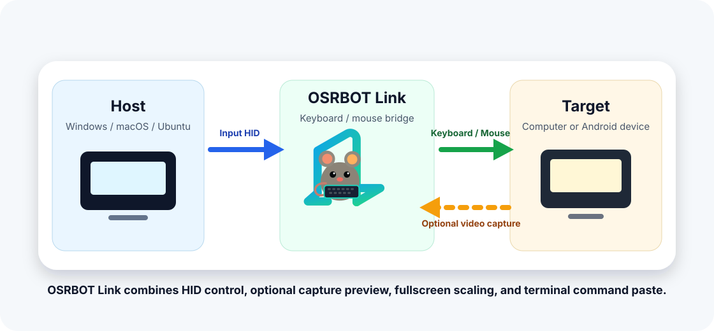

# OSRBOT Link Desktop

OSRBOT Link Desktop 是 OSRBOT Link 的桌面客户端，用于配合 OSRBOT 键盘鼠标共享器 2.0 完成键盘、鼠标共享和可选的视频预览控制。

## 功能

- OSRBOT HID 键盘鼠标共享。
- 可选 USB 采集卡视频预览。
- 无采集卡时可作为纯键鼠共享器使用。
- 电脑/安卓目标设备模式。
- 自适应、填满、原始三种画面缩放模式。
- 全屏工具栏自动隐藏和手动显示/隐藏。
- 右 Ctrl 退出控制模式，Shift+Esc 退出全屏和控制模式。
- 终端命令粘贴，支持 ASCII 命令文本。
- 自定义采集分辨率。
- 手动切换被控端显示输出。
- 截图、录屏和 GIF 录制。
- 明亮/深色皮肤切换。
- 中文/英文界面。

## 平台

- macOS
- Windows
- Ubuntu Linux

## Contributors

- [sunmaxwll](https://github.com/sunmaxwll)
- [dajianli](https://github.com/dajianli)
- [kitso666](https://github.com/kitso666)

## Thanks

感谢 [MotorBottle](https://github.com/MotorBottle) 和 [Jackadminx/KVM-Card-Mini](https://github.com/Jackadminx/KVM-Card-Mini) 对本项目设计与技术探索的参考价值。
